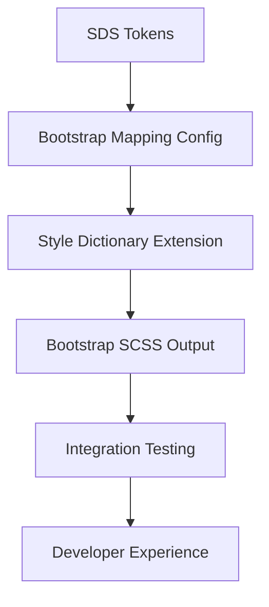

# 🚀 SDS Bootstrap Mapper Implementation

## Overview
This directory contains the complete implementation plan for adding Bootstrap 5.3 support to the SDS Design System. The mapper system will allow SDS design tokens to automatically generate Bootstrap SCSS variable overrides, enabling teams to use SDS design consistency with existing Bootstrap codebases.

## 🎯 Business Value
- **Universal Adoption**: Enable SDS usage in existing Bootstrap projects without migration
- **Rapid Prototyping**: Use Bootstrap components with SDS design tokens immediately  
- **Migration Path**: Gradual transition from Bootstrap to native SDS components
- **Ecosystem Integration**: Foundation for supporting multiple CSS frameworks

## 📁 Documentation Structure

### Implementation Tasks
- **[task-01-mapping-config.md](./task-01-mapping-config.md)**: Bootstrap variable mapping configuration
- **[task-02-style-dictionary-extension.md](./task-02-style-dictionary-extension.md)**: Style Dictionary transforms and formats
- **[task-03-build-target.md](./task-03-build-target.md)**: Bootstrap build platform integration
- **[task-04-npm-scripts.md](./task-04-npm-scripts.md)**: Developer experience and CLI commands
- **[task-05-testing-validation.md](./task-05-testing-validation.md)**: Quality assurance and validation

### Reference Materials
- **[bootstrap-analysis.md](./bootstrap-analysis.md)**: Bootstrap 5.3 variable analysis
- **[token-mapping-strategy.md](./token-mapping-strategy.md)**: SDS → Bootstrap mapping approach
- **[architecture-decisions.md](./architecture-decisions.md)**: Technical design decisions

## 🔄 Implementation Flow

## ✅ Success Criteria
1. Existing SDS functionality remains unchanged
2. Generated Bootstrap overrides are valid SCSS
3. Bootstrap components reflect SDS design tokens
4. Easy integration with existing Bootstrap projects
5. Foundation for additional framework support

## 🚀 Getting Started
Follow the tasks in numerical order, each contains detailed user stories, acceptance criteria, and implementation guidance.