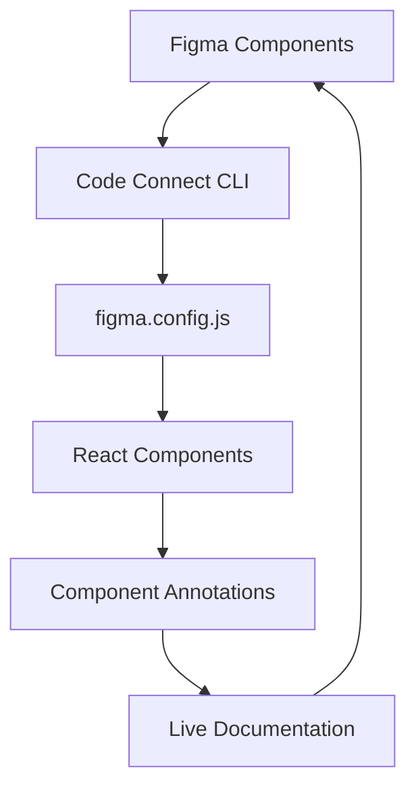

# Figma Code Connect Documentation

## 📖 Overview

Figma Code Connect bridges the gap between design and development by linking your React components directly to Figma components. This documentation covers everything you need to set up and maintain a robust design-to-code workflow.

## 🚀 Quick Start

### Prerequisites

- Figma Design file with organized components
- React project with existing components
- Figma account with appropriate permissions
- Node.js 18+ installed

### Basic Setup

1. **Install Figma Code Connect CLI**
   ```bash
   npm install -g @figma/code-connect
   ```

2. **Configure your project** (see [Configuration Guide](./configuration.md))
3. **Define your components** (see [Component Definitions](./component-definitions.md))
4. **Connect components** (see [Component Connections](./component-connections.md))

## 📚 Documentation Index

| Guide | Description | Level |
|-------|-------------|-------|
| [**Configuration**](./configuration.md) | Set up figma.config.js and authentication | Beginner |
| [**Component Definitions**](./component-definitions.md) | How to define and annotate components | Intermediate |
| [**Component Connections**](./component-connections.md) | Connect React components to Figma | Intermediate |
| [**Examples & Patterns**](./examples.md) | Real-world examples and best practices | Advanced |
| [**Troubleshooting**](./troubleshooting.md) | Common issues and solutions | All Levels |

## 🎯 Key Benefits

### For Designers
- ✅ **Live Code Preview** - See actual component code in Figma
- ✅ **Prop Documentation** - Understand component APIs
- ✅ **Usage Examples** - View real implementation patterns
- ✅ **Sync Status** - Know when code changes

### For Developers
- ✅ **Design Spec Accuracy** - Ensure implementation matches design
- ✅ **Component Discovery** - Find existing components easily
- ✅ **Documentation Automation** - Auto-generate component docs
- ✅ **Design System Governance** - Maintain consistency

### For Teams
- ✅ **Reduced Handoff Friction** - Clear design-to-code mapping
- ✅ **Component Reuse** - Leverage existing component library
- ✅ **Quality Assurance** - Catch design-code mismatches early
- ✅ **Workflow Efficiency** - Streamlined design system updates

## 🏗️ Architecture Overview



### Core Components

1. **Figma Components** - Design components in Figma
2. **React Components** - Implementation in your codebase
3. **Code Connect Annotations** - Metadata linking design to code
4. **figma.config.js** - Project configuration
5. **CLI Tools** - Commands for syncing and validation

## 🎨 Design System Integration

### Component Hierarchy

```text
Design System/
├── Atoms/
│   ├── Button
│   ├── Input
│   └── Icon
├── Molecules/
│   ├── SearchBar
│   ├── Card
│   └── Navigation
└── Organisms/
    ├── Header
    ├── ProductGrid
    └── Footer
```

### Code Organization

```text
src/
├── components/
│   ├── ui/
│   │   ├── Button/
│   │   │   ├── Button.tsx
│   │   │   ├── Button.figma.tsx
│   │   │   └── index.ts
│   │   └── Card/
│   │       ├── Card.tsx
│   │       ├── Card.figma.tsx
│   │       └── index.ts
│   └── layout/
├── figma.config.js
└── package.json
```

## 🔄 Workflow Overview

### 1. **Design Phase**
- Create components in Figma
- Define variants and properties
- Organize in design system structure
- Document component usage

### 2. **Development Phase**
- Implement React components
- Add Code Connect annotations
- Configure figma.config.js
- Run sync commands

### 3. **Integration Phase**
- Connect components using CLI
- Validate connections
- Test in Figma Dev Mode
- Update documentation

### 4. **Maintenance Phase**
- Monitor sync status
- Update connections on changes
- Review design-code alignment
- Iterate based on feedback

## 🛠️ CLI Commands Reference

```bash
# Initialize Code Connect in project
figma connect init

# Connect a single component
figma connect create src/components/Button/Button.tsx

# Connect all components
figma connect create --all

# Validate connections
figma connect validate

# Publish connections to Figma
figma connect publish

# Check connection status
figma connect status
```

## 📋 Prerequisites Checklist

Before starting with Figma Code Connect:

- [ ] Figma file with organized component library
- [ ] React project with component structure
- [ ] Figma account with editing permissions
- [ ] Node.js 18+ and npm/yarn installed
- [ ] Git repository for version control
- [ ] Team access to both Figma and codebase

## 🔐 Security & Permissions

### Required Figma Permissions
- **File Access** - Read/write to design files
- **Team Membership** - Access to team components
- **Developer Access** - API token generation

### Authentication Methods
- **Personal Access Token** (recommended for development)
- **OAuth Integration** (for team workflows)
- **Team API Keys** (for CI/CD pipelines)

## 🚀 Getting Started

Ready to implement Figma Code Connect? Start with our step-by-step guides:

1. 📋 **[Configuration Setup](./configuration.md)** - Configure your project
2. 🏗️ **[Component Definitions](./component-definitions.md)** - Define your components
3. 🔗 **[Component Connections](./component-connections.md)** - Connect design to code
4. 💡 **[Examples & Patterns](./examples.md)** - Learn from real examples

---

> 💡 **Need Help?** Check our [Troubleshooting Guide](./troubleshooting.md) or reach out to the team.