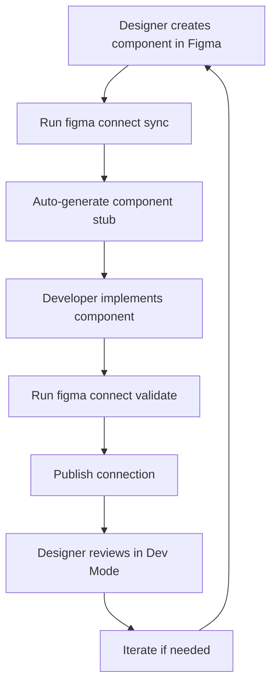
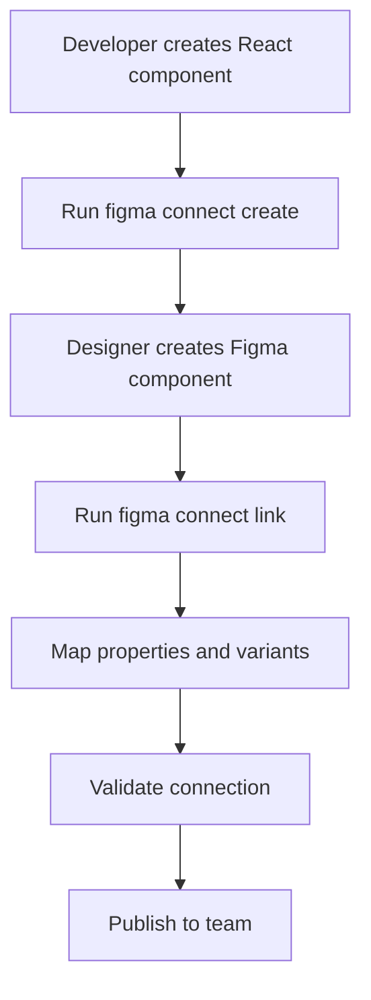

# Examples & Best Practices

## 📋 Overview

This guide provides real-world examples, patterns, and best practices for implementing Figma Code Connect in production environments.

## 🏗️ Complete Component Examples

### Example 1: Design System Button

#### Figma Component Structure

```text
Button Component in Figma:
├── Properties:
│   ├── Variant (Primary, Secondary, Danger)
│   ├── Size (Small, Medium, Large)
│   ├── State (Default, Hover, Disabled)
│   └── Icon (None, Left Icon, Right Icon)
└── Layers:
    ├── Background (Rectangle)
    ├── Button Text (Text)
    └── Icon (Instance Swap)
```

#### React Component Implementation

```typescript
// src/components/ui/Button/Button.tsx
import React from 'react';
import { cn } from '../../../lib/utils';
import { IconType } from '../../../types/icons';

export interface ButtonProps extends React.ButtonHTMLAttributes<HTMLButtonElement> {
  variant?: 'primary' | 'secondary' | 'danger';
  size?: 'small' | 'medium' | 'large';
  disabled?: boolean;
  leftIcon?: IconType;
  rightIcon?: IconType;
  children: React.ReactNode;
}

export const Button = React.forwardRef<HTMLButtonElement, ButtonProps>(
  ({ 
    variant = 'primary', 
    size = 'medium', 
    disabled = false,
    leftIcon: LeftIcon,
    rightIcon: RightIcon,
    children, 
    className,
    ...props 
  }, ref) => {
    const baseClasses = 'inline-flex items-center justify-center rounded-md font-medium transition-colors focus:outline-none focus:ring-2 focus:ring-offset-2';
    
    const variantClasses = {
      primary: 'bg-blue-600 text-white hover:bg-blue-700 focus:ring-blue-500',
      secondary: 'bg-gray-200 text-gray-900 hover:bg-gray-300 focus:ring-gray-500',
      danger: 'bg-red-600 text-white hover:bg-red-700 focus:ring-red-500'
    };
    
    const sizeClasses = {
      small: 'px-3 py-1.5 text-sm gap-1.5',
      medium: 'px-4 py-2 text-base gap-2',
      large: 'px-6 py-3 text-lg gap-2.5'
    };

    return (
      <button
        ref={ref}
        className={cn(
          baseClasses,
          variantClasses[variant],
          sizeClasses[size],
          disabled && 'opacity-50 cursor-not-allowed',
          className
        )}
        disabled={disabled}
        {...props}
      >
        {LeftIcon && <LeftIcon className="w-4 h-4" />}
        {children}
        {RightIcon && <RightIcon className="w-4 h-4" />}
      </button>
    );
  }
);

Button.displayName = 'Button';
```

#### Figma Code Connect Definition

```typescript
// src/components/ui/Button/Button.figma.tsx
import React from 'react';
import { figma } from '@figma/code-connect';
import { Button } from './Button';
import { ChevronRightIcon, DownloadIcon } from '../../../components/icons';

/**
 * Button Component - Primary interactive element
 * 
 * @figma https://www.figma.com/file/YOUR_KEY?node-id=123:456
 */
figma.connect(
  Button,
  'https://www.figma.com/file/YOUR_KEY?node-id=123:456',
  {
    props: {
      variant: figma.enum('Variant', {
        Primary: 'primary',
        Secondary: 'secondary',
        Danger: 'danger'
      }),
      size: figma.enum('Size', {
        Small: 'small',
        Medium: 'medium',
        Large: 'large'
      }),
      disabled: figma.boolean('State', {
        Default: false,
        Hover: false,
        Disabled: true
      }),
      children: figma.textContent('Button Text'),
      leftIcon: figma.instance('Icon', {
        'Download': <DownloadIcon />,
        'None': undefined
      }),
      rightIcon: figma.instance('Icon', {
        'Chevron Right': <ChevronRightIcon />,
        'None': undefined
      })
    },
    
    variants: {
      'Variant=Primary, Size=Medium, Icon=None': () => (
        <Button variant="primary" size="medium">
          Primary Button
        </Button>
      ),
      'Variant=Secondary, Size=Small, Icon=Download': () => (
        <Button variant="secondary" size="small" leftIcon={DownloadIcon}>
          Download
        </Button>
      ),
      'Variant=Primary, Size=Large, Icon=Chevron Right': () => (
        <Button variant="primary" size="large" rightIcon={ChevronRightIcon}>
          Continue
        </Button>
      ),
      'State=Disabled': () => (
        <Button disabled>
          Disabled Button
        </Button>
      )
    },
    
    example: () => (
      <div className="space-y-4">
        <Button variant="primary" onClick={() => console.log('clicked')}>
          Primary Action
        </Button>
        <Button variant="secondary" leftIcon={DownloadIcon}>
          Download File
        </Button>
      </div>
    )
  }
);
```

### Example 2: Card Component with Complex Layout

#### React Component

```typescript
// src/components/ui/Card/Card.tsx
import React from 'react';
import { Button } from '../Button/Button';

export interface CardProps {
  variant?: 'elevated' | 'outlined' | 'filled';
  image?: string;
  imageAlt?: string;
  title: string;
  subtitle?: string;
  description?: string;
  tags?: string[];
  actions?: Array<{
    label: string;
    variant?: 'primary' | 'secondary';
    onClick: () => void;
  }>;
  className?: string;
}

export const Card: React.FC<CardProps> = ({
  variant = 'elevated',
  image,
  imageAlt,
  title,
  subtitle,
  description,
  tags = [],
  actions = [],
  className
}) => {
  const variantClasses = {
    elevated: 'bg-white shadow-lg border border-gray-200',
    outlined: 'bg-white border-2 border-gray-300',
    filled: 'bg-gray-50 border border-gray-200'
  };

  return (
    <div className={cn('rounded-lg overflow-hidden', variantClasses[variant], className)}>
      {image && (
        <div className="aspect-video w-full">
          
        </div>
      )}
      
      <div className="p-6">
        <div className="space-y-3">
          {subtitle && (
            <p className="text-sm text-gray-600 font-medium uppercase tracking-wide">
              {subtitle}
            </p>
          )}
          
          <h3 className="text-xl font-semibold text-gray-900">
            {title}
          </h3>
          
          {description && (
            <p className="text-gray-600 leading-relaxed">
              {description}
            </p>
          )}
          
          {tags.length > 0 && (
            <div className="flex flex-wrap gap-2">
              {tags.map((tag, index) => (
                <span 
                  key={index}
                  className="inline-flex items-center px-2.5 py-0.5 rounded-full text-xs font-medium bg-blue-100 text-blue-800"
                >
                  {tag}
                </span>
              ))}
            </div>
          )}
        </div>
        
        {actions.length > 0 && (
          <div className="flex gap-3 mt-6">
            {actions.map((action, index) => (
              <Button
                key={index}
                variant={action.variant || 'secondary'}
                onClick={action.onClick}
              >
                {action.label}
              </Button>
            ))}
          </div>
        )}
      </div>
    </div>
  );
};
```

#### Figma Code Connect Definition

```typescript
// src/components/ui/Card/Card.figma.tsx
import React from 'react';
import { figma } from '@figma/code-connect';
import { Card } from './Card';

figma.connect(
  Card,
  'https://www.figma.com/file/YOUR_KEY?node-id=789:012',
  {
    props: {
      variant: figma.enum('Variant', {
        Elevated: 'elevated',
        Outlined: 'outlined',
        Filled: 'filled'
      }),
      
      // Image handling
      image: figma.boolean('Has Image', {
        true: 'https://images.unsplash.com/photo-1618005198919-d3d4b5a92ead?w=400',
        false: undefined
      }),
      
      // Content mapping
      title: figma.textContent('Card Title'),
      subtitle: figma.textContent('Card Subtitle'),
      description: figma.textContent('Card Description'),
      
      // Tags from child components
      tags: figma.children(['Tag'], (tag) => tag.textContent('Tag Text')),
      
      // Actions from button instances
      actions: figma.children(['Action Button'], (button) => ({
        label: button.textContent('Button Text'),
        variant: button.getProperty('Variant') === 'Primary' ? 'primary' : 'secondary',
        onClick: () => console.log(`${button.textContent('Button Text')} clicked`)
      }))
    },
    
    variants: {
      'Variant=Elevated, Has Image=true': () => (
        <Card
          variant="elevated"
          image="https://images.unsplash.com/photo-1618005198919-d3d4b5a92ead?w=400"
          title="Product Title"
          subtitle="Category"
          description="This is a detailed description of the product or content."
          tags={['New', 'Featured']}
          actions={[
            { label: 'View Details', variant: 'primary', onClick: () => {} },
            { label: 'Add to Cart', variant: 'secondary', onClick: () => {} }
          ]}
        />
      ),
      
      'Variant=Outlined, Has Image=false': () => (
        <Card
          variant="outlined"
          title="Simple Card"
          description="A card without an image."
          actions={[
            { label: 'Learn More', variant: 'secondary', onClick: () => {} }
          ]}
        />
      )
    }
  }
);
```

## 🎯 Integration Patterns

### Pattern 1: Design System Integration

```typescript
// src/design-system/figma-connect.ts
import { figma } from '@figma/code-connect';

// Register all design system components
export const registerDesignSystemComponents = () => {
  // Atoms
  import('./components/atoms/Button/Button.figma');
  import('./components/atoms/Input/Input.figma');
  import('./components/atoms/Badge/Badge.figma');
  
  // Molecules
  import('./components/molecules/SearchBar/SearchBar.figma');
  import('./components/molecules/Card/Card.figma');
  
  // Organisms
  import('./components/organisms/Header/Header.figma');
  import('./components/organisms/ProductGrid/ProductGrid.figma');
};

// Initialize in main entry point
registerDesignSystemComponents();
```

### Pattern 2: Storybook Integration

```typescript
// .storybook/figma-connect.ts
import type { Meta, StoryObj } from '@storybook/react';
import { figma } from '@figma/code-connect';
import { Button } from '../src/components/Button/Button';

// Generate Storybook stories from Figma variants
export const generateStoriesFromFigma = (component: any, figmaUrl: string) => {
  const meta: Meta<typeof component> = {
    title: component.displayName || component.name,
    component,
    parameters: {
      docs: {
        description: {
          component: `Connected to Figma: ${figmaUrl}`
        }
      },
      figma: {
        url: figmaUrl
      }
    }
  };

  // Auto-generate stories from Figma variants
  const stories = figma.getVariants(figmaUrl).reduce((acc, variant) => {
    acc[variant.name] = {
      args: variant.props
    };
    return acc;
  }, {} as Record<string, StoryObj<typeof component>>);

  return { meta, ...stories };
};
```

### Pattern 3: Documentation Generation

```typescript
// scripts/generate-docs.ts
import { figma } from '@figma/code-connect';
import fs from 'fs';
import path from 'path';

export const generateComponentDocs = async () => {
  const connections = await figma.getAllConnections();
  
  for (const connection of connections) {
    const componentName = connection.component.displayName;
    const figmaUrl = connection.figmaUrl;
    const props = connection.props;
    
    const markdown = `
# ${componentName}

## Figma Component
[View in Figma](${figmaUrl})

## Props
${Object.entries(props).map(([key, mapping]) => 
  `- **${key}**: ${mapping.description || 'No description'}`
).join('\n')}

## Usage
\`\`\`tsx
import { ${componentName} } from './components/${componentName}';

<${componentName} 
  ${Object.keys(props).map(key => `${key}={/* value */}`).join('\n  ')}
/>
\`\`\`

## Variants
${connection.variants.map(variant => 
  `### ${variant.name}\n\`\`\`tsx\n${variant.code}\n\`\`\``
).join('\n\n')}
    `;
    
    fs.writeFileSync(
      path.join('docs/components', `${componentName}.md`),
      markdown
    );
  }
};
```

## 🔄 Team Workflow Patterns

### Workflow 1: Design-First Development



```bash
# Designer workflow
figma connect sync --auto-generate-stubs

# Developer workflow
npm run dev
figma connect watch  # Auto-validate changes

# Review workflow
figma connect publish --message "Updated Button variants"
figma connect status --team-review
```

### Workflow 2: Code-First Development



```bash
# Developer workflow
figma connect create src/components/NewComponent.tsx --generate-figma-stub

# Designer workflow
# (Create component in Figma using generated stub)

# Integration workflow
figma connect link src/components/NewComponent.tsx --figma-url "..."
figma connect validate --fix-mappings
figma connect publish
```

### Workflow 3: Continuous Integration

```yaml
# .github/workflows/figma-connect.yml
name: Figma Code Connect CI

on:
  pull_request:
    paths: ['src/components/**']

jobs:
  validate-connections:
    runs-on: ubuntu-latest
    steps:
      - uses: actions/checkout@v3
      
      - name: Setup Node.js
        uses: actions/setup-node@v3
        with:
          node-version: '18'
          
      - name: Install dependencies
        run: npm ci
        
      - name: Validate Figma connections
        run: |
          npx figma connect validate --ci
          npx figma connect lint
        env:
          FIGMA_ACCESS_TOKEN: ${{ secrets.FIGMA_ACCESS_TOKEN }}
          
      - name: Generate connection report
        run: npx figma connect report --output figma-report.json
        
      - name: Upload report
        uses: actions/upload-artifact@v3
        with:
          name: figma-connection-report
          path: figma-report.json
```

## 📊 Monitoring & Analytics

### Connection Health Dashboard

```typescript
// scripts/connection-health.ts
import { figma } from '@figma/code-connect';

export const generateHealthReport = async () => {
  const connections = await figma.getAllConnections();
  
  const report = {
    totalComponents: connections.length,
    connectedComponents: connections.filter(c => c.status === 'connected').length,
    outdatedConnections: connections.filter(c => c.needsUpdate).length,
    missingMappings: connections.filter(c => c.missingProps.length > 0).length,
    
    // Component coverage by category
    coverage: {
      atoms: getCoverage('atoms'),
      molecules: getCoverage('molecules'), 
      organisms: getCoverage('organisms')
    },
    
    // Recent activity
    recentUpdates: connections
      .filter(c => c.lastUpdated > Date.now() - 7 * 24 * 60 * 60 * 1000)
      .sort((a, b) => b.lastUpdated - a.lastUpdated)
  };
  
  return report;
};

// Usage in monitoring dashboard
const healthReport = await generateHealthReport();
console.log(`Connection Health: ${healthReport.connectedComponents}/${healthReport.totalComponents} connected`);
```

### Automated Drift Detection

```typescript
// scripts/detect-drift.ts
export const detectDesignCodeDrift = async () => {
  const connections = await figma.getAllConnections();
  const driftReport = [];
  
  for (const connection of connections) {
    const figmaComponent = await figma.getComponent(connection.figmaUrl);
    const codeComponent = await loadComponent(connection.componentPath);
    
    // Check for property mismatches
    const figmaProps = figmaComponent.properties;
    const codeProps = codeComponent.propTypes || codeComponent.interface;
    
    const missingInCode = figmaProps.filter(p => !codeProps.includes(p.name));
    const missingInFigma = codeProps.filter(p => !figmaProps.find(fp => fp.name === p.name));
    
    if (missingInCode.length > 0 || missingInFigma.length > 0) {
      driftReport.push({
        component: connection.component.name,
        missingInCode,
        missingInFigma,
        severity: calculateSeverity(missingInCode, missingInFigma)
      });
    }
  }
  
  return driftReport;
};
```

## ✅ Best Practice Checklist

### Component Definition

- [ ] Component has clear, descriptive name
- [ ] All props are properly typed with TypeScript
- [ ] Component follows design system conventions
- [ ] Accessibility attributes included
- [ ] Component is properly documented

### Figma Setup

- [ ] Figma component is properly organized in design system
- [ ] All variants are defined and named consistently
- [ ] Properties use clear, descriptive names
- [ ] Component states (hover, disabled) are defined
- [ ] Component is published to team library

### Code Connect Configuration

- [ ] figma.config.js is properly configured
- [ ] Authentication is set up securely
- [ ] Include/exclude patterns are optimized
- [ ] Component discovery is working correctly

### Connection Quality

- [ ] All component props are mapped to Figma properties
- [ ] All major variants have examples defined
- [ ] Property mappings use correct names and values
- [ ] Connection is validated without errors
- [ ] Component renders correctly in Figma Dev Mode

### Team Integration

- [ ] Connection is published and accessible to team
- [ ] Documentation is up to date
- [ ] CI/CD pipeline validates connections
- [ ] Design and development workflows are aligned
- [ ] Regular health checks are performed

---

> 💡 **Need Help?** Check the [Troubleshooting Guide](./troubleshooting.md) for common issues and solutions.